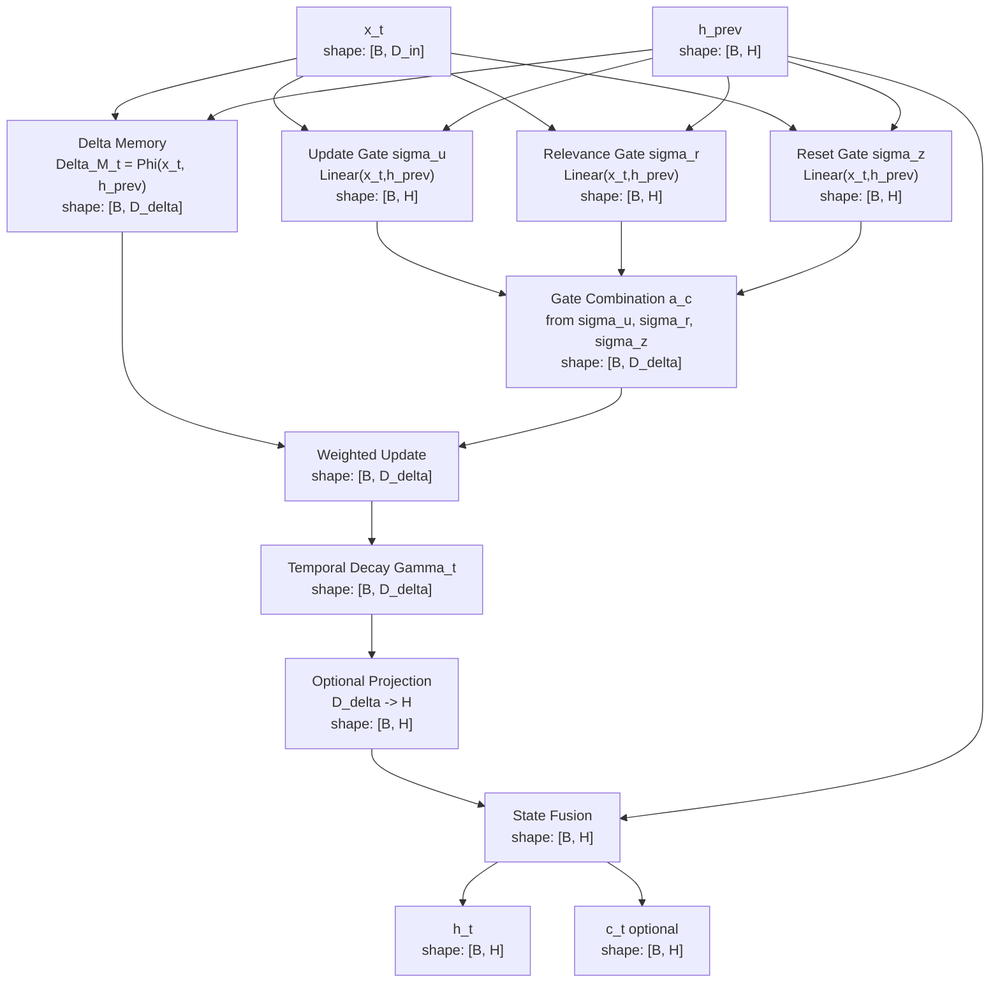
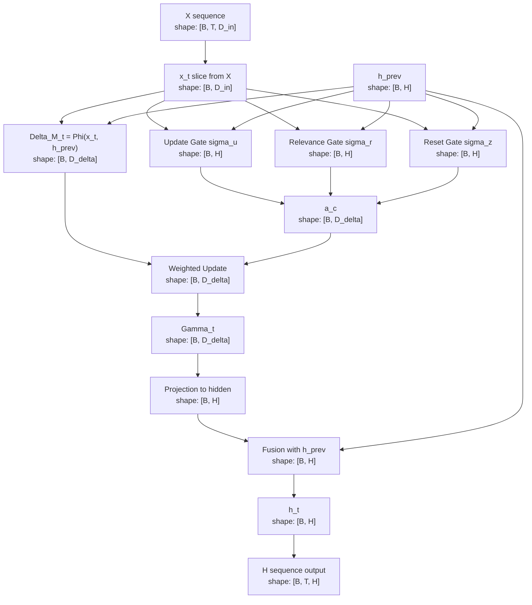

## 单个时间步

```mermaid
flowchart TD
    X["x_t\nshape: [B, D_in]"]
    Hprev["h_prev\nshape: [B, H]"]

    GU["Update Gate sigma_u\nLinear(x_t,h_prev)\nshape: [B, H]"]
    GR["Relevance Gate sigma_r\nLinear(x_t,h_prev)\nshape: [B, H]"]
    GZ["Reset Gate sigma_z\nLinear(x_t,h_prev)\nshape: [B, H]"]

    PHI["Delta Memory\nDelta_M_t = Phi(x_t, h_prev)\nshape: [B, D_delta]"]
    AC["Gate Combination a_c\nfrom sigma_u, sigma_r, sigma_z\nshape: [B, D_delta]"]

    SUM1["Weighted Update\nshape: [B, D_delta]"]
    DECAY["Temporal Decay Gamma_t\nshape: [B, D_delta]"]
    PROJ["Optional Projection\nD_delta -> H\nshape: [B, H]"]

    SUM2["State Fusion\nshape: [B, H]"]
    H["h_t\nshape: [B, H]"]
    C["c_t optional\nshape: [B, H]"]

    X --> GU
    Hprev --> GU

    X --> GR
    Hprev --> GR

    X --> GZ
    Hprev --> GZ

    X --> PHI
    Hprev --> PHI

    GU --> AC
    GR --> AC
    GZ --> AC

    PHI --> SUM1
    AC --> SUM1

    SUM1 --> DECAY
    DECAY --> PROJ
    PROJ --> SUM2
    Hprev --> SUM2

    SUM2 --> H
    SUM2 --> C
```

## 整段序列输入

```mermaid
flowchart TD
    Xall["X sequence\nshape: [B, T, D_in]"]
    X["x_t slice from X\nshape: [B, D_in]"]
    Hprev["h_prev\nshape: [B, H]"]

    GU["Update Gate sigma_u\nshape: [B, H]"]
    GR["Relevance Gate sigma_r\nshape: [B, H]"]
    GZ["Reset Gate sigma_z\nshape: [B, H]"]

    PHI["Delta_M_t = Phi(x_t, h_prev)\nshape: [B, D_delta]"]
    AC["a_c\nshape: [B, D_delta]"]

    SUM1["Weighted Update\nshape: [B, D_delta]"]
    DECAY["Gamma_t\nshape: [B, D_delta]"]
    PROJ["Projection to hidden\nshape: [B, H]"]

    SUM2["Fusion with h_prev\nshape: [B, H]"]
    H["h_t\nshape: [B, H]"]
    Hall["H sequence output\nshape: [B, T, H]"]

    Xall --> X

    X --> GU
    Hprev --> GU

    X --> GR
    Hprev --> GR

    X --> GZ
    Hprev --> GZ

    X --> PHI
    Hprev --> PHI

    GU --> AC
    GR --> AC
    GZ --> AC

    PHI --> SUM1
    AC --> SUM1
    SUM1 --> DECAY
    DECAY --> PROJ
    PROJ --> SUM2
    Hprev --> SUM2
    SUM2 --> H
    H --> Hall
```